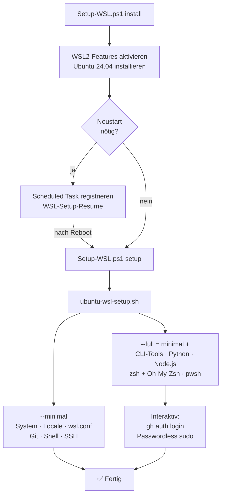

<div align="center">

# WSL Ubuntu Setup

Automatisiertes WSL2-Setup mit kuratierter Entwicklungsumgebung — von null auf produktiv in einem Befehl

[](https://docs.microsoft.com/windows/wsl/)
[](https://docs.microsoft.com/powershell/)
[](https://ubuntu.com/wsl)
[](https://github.com/reze83/wsl-ubuntu-powershell/actions/workflows/lint.yml)
[](LICENSE)

</div>

---

## 🎬 Demo

<!-- Demo-GIF hier einfügen, sobald aufgenommen:
     
     Aufnehmen mit: vhs demo.tape  (benötigt: https://github.com/charmbracelet/vhs) -->

> [!NOTE]
> **Demo-Recording folgt.** `demo.tape` liegt bereit — einfach `vhs demo.tape` ausführen, sobald VHS installiert ist.

---

## 📋 Inhaltsverzeichnis

- [✨ Features](#-features)
- [📋 Voraussetzungen](#-voraussetzungen)
- [🚀 Quick Start](#-quick-start)
- [📖 Usage](#-usage)
- [⚙️ Ubuntu Setup — Modi](#️-ubuntu-setup--modi)
- [🔨 Nach dem Setup](#-nach-dem-setup)
- [🏗️ Architektur](#️-architektur)
- [🧰 Linting](#-linting)
- [🤝 Beitragen](#-beitragen)
- [📄 License](#-license)

---

## ✨ Features

- **Ein Einstiegspunkt** — `Setup-WSL.ps1` steuert den gesamten Lifecycle (install → setup → reset → uninstall)
- **Automatische UAC-Elevation** — kein manuelles "Als Administrator ausführen" nötig
- **Auto-Resume nach Neustart** — bei Windows-Feature-Aktivierung registriert das Script einen Scheduled Task und setzt nach dem Reboot automatisch fort
- **Vollständiger Dry-Run** — alle Schritte werden vor der Ausführung angezeigt, nichts wird verändert
- **Idempotentes Design** — das Script kann mehrfach ausgeführt werden, bereits installierte Tools werden übersprungen
- **Sicheres Download-Pattern** — kein `curl | bash`; alle Installer werden zuerst heruntergeladen, dann ausgeführt
- **Zwei Modi** — `--minimal` für Server/CI, `--full` für komplette Entwicklungsumgebung
- **Git out-of-the-box** — Delta-Pager, Windows Credential Manager, optimale WSL-Defaults

---

## 📋 Voraussetzungen

| Anforderung | Details |
|---|---|
| Windows Build | mind. **19041** (Windows 10 v2004 / Windows 11) — wird automatisch geprüft |
| PowerShell | **5.1+** (im Lieferumfang von Windows) |
| Administrator-Rechte | Werden automatisch per UAC angefragt — kein manuelles Starten als Admin nötig |
| Internetverbindung | Erforderlich für `--full` (apt, GitHub Releases, npm) |

---

## 🚀 Quick Start

Zwei Schritte — PowerShell **ohne** Admin starten, das Script fordert Elevation selbst an:

**Schritt 1: WSL2 + Ubuntu installieren**

```powershell
.\Setup-WSL.ps1 install
```

> [!NOTE]
> Falls Windows-Features noch nicht aktiv sind, wird ein Neustart benötigt. Das Script setzt danach **automatisch** fort — einfach neu anmelden.

Nach dem ersten Ubuntu-Start ein UNIX-Benutzerkonto anlegen (Name + Passwort setzen), dann `exit` eingeben.

**Schritt 2: Entwicklungsumgebung konfigurieren**

```powershell
.\Setup-WSL.ps1 setup
```

> [!TIP]
> Git-Name, E-Mail und SSH-Key lassen sich direkt übergeben und müssen dann nicht interaktiv eingegeben werden:
> ```powershell
> .\Setup-WSL.ps1 setup -GitUserName "Max Mustermann" -GitUserEmail "max@example.com" -SshKeyEmail "max@example.com"
> ```

---

## 📖 Usage

### `Setup-WSL.ps1` — Alle Actions

```
.\Setup-WSL.ps1 [Action] [Parameter...]
```

| Action | Beschreibung | Rechte |
|--------|-------------|--------|
| `install` *(Standard)* | WSL2-Features aktivieren, Ubuntu installieren, Auto-Resume-Task einrichten | Admin |
| `setup` | `ubuntu-wsl-setup.sh` in WSL ausführen | Kein Admin |
| `reset` | Ubuntu deregistrieren + sofort neu installieren | Admin |
| `uninstall` | Ubuntu deregistrieren, Windows Terminal Profile bereinigen | Admin |
| `status` | WSL-Status + installierte Distros anzeigen | Kein Admin |

### Parameter

| Parameter | Typ | Standard | Beschreibung |
|-----------|-----|----------|--------------|
| `-Distribution` | String | `Ubuntu-24.04` | Distribution — `Ubuntu-24.04`, `Ubuntu-22.04`, `Ubuntu` |
| `-SetupMode` | String | `full` | Bash-Script-Modus — `minimal` oder `full` |
| `-GitUserName` | String | — | Git `user.name` vorbelegen |
| `-GitUserEmail` | String | — | Git `user.email` vorbelegen |
| `-SshKeyEmail` | String | — | E-Mail für SSH-Key (Fallback: `-GitUserEmail`) |
| `-DryRun` | Switch | — | Alle Schritte anzeigen ohne auszuführen |
| `-RemoveWSLFeatures` | Switch | — | Nur bei `uninstall`: WSL2-Windows-Features ebenfalls deaktivieren |

### Beispiele

<details>
<summary>Alle Aufruf-Varianten anzeigen...</summary>

```powershell
# Andere Ubuntu-Version installieren
.\Setup-WSL.ps1 install -Distribution Ubuntu-22.04
.\Setup-WSL.ps1 setup -Distribution Ubuntu-22.04

# Nur Basis-Setup ohne Dev-Tools (für Server/CI)
.\Setup-WSL.ps1 setup -SetupMode minimal

# Vorschau aller Schritte (keine Änderungen)
.\Setup-WSL.ps1 install -DryRun
.\Setup-WSL.ps1 setup -SetupMode full -DryRun
.\Setup-WSL.ps1 uninstall -RemoveWSLFeatures -DryRun

# WSL-Status anzeigen
.\Setup-WSL.ps1 status

# Komplett neu aufsetzen
.\Setup-WSL.ps1 reset

# Vollständig deinstallieren inkl. Windows-Features
.\Setup-WSL.ps1 uninstall -RemoveWSLFeatures

# Nach dem Setup: WSL neu starten damit wsl.conf aktiv wird
wsl --shutdown
```

</details>

---

## ⚙️ Ubuntu Setup — Modi

Das `ubuntu-wsl-setup.sh` Script wird von `Setup-WSL.ps1 setup` automatisch aufgerufen.

### `--minimal`

Basis-Konfiguration für Server oder schlanke Setups (~2–5 Minuten):

- System-Update (`apt-get full-upgrade`)
- Basispakete: `curl`, `wget`, `git`, `build-essential`, `openssh-client`, u.a.
- Locale: `en_US.UTF-8` + `de_DE.UTF-8`
- `/etc/wsl.conf`: `systemd=true`, `appendWindowsPath=false`
- Kernel-Parameter: `vm.swappiness=10`, `vm.vfs_cache_pressure=50`
- Git-Konfiguration (Delta-Pager, Windows GCM, optimale WSL-Defaults)
- Shell: `.bashrc` (History, Aliases, PATH) + `.inputrc` (Pfeiltasten-Suche)
- SSH: `~/.ssh/config` + optional SSH-Key generieren (ed25519)

### `--full` *(Standard)*

Alles aus `--minimal`, plus (~10–20 Minuten je nach Internetgeschwindigkeit):

<details>
<summary>Vollständige Tool-Liste anzeigen...</summary>

| Tool | Beschreibung | Kategorie |
|------|-------------|-----------|
| `eza` | Modernes `ls` mit Icons und Git-Status | Shell |
| `bat` | `cat` mit Syntax-Highlighting und Zeilennummern | Shell |
| `fd` | Schnelleres `find` | Shell |
| `ripgrep` | Schnellste Textsuche (`rg`) | Dev |
| `fzf` | Fuzzy Finder für alle Terminal-Workflows | Shell |
| `zoxide` | Smarter `cd`-Ersatz mit Lerneffekt | Shell |
| `git-delta` | Farbiger Diff-Viewer als Git-Pager | Dev |
| `lazygit` | Terminal Git-UI | Dev |
| `gh` | GitHub CLI | Dev |
| `yq` | YAML-Processor (wie `jq` für YAML) | Dev |
| `jq` | JSON-Processor | Dev |
| `pwsh` | PowerShell Core in WSL | Dev |
| `tmux` | Terminal-Multiplexer mit Catppuccin-Theme | Shell |
| `gcc`, `g++`, `clang` | C/C++ Compiler | C/C++ |
| `cmake`, `ninja-build`, `gdb` | C/C++ Build & Debug | C/C++ |
| `sqlite3`, `postgresql-client` | Datenbank-Clients | DB |
| `python3` + `uv` | Python mit modernem Package Manager | Python |
| Node.js LTS + `pnpm` | JavaScript Runtime via nvm | Node.js |
| `zsh` + Oh-My-Zsh | Z-Shell mit Plugins und Auto-Completions | Shell |
| `zsh-autosuggestions` | Fish-ähnliche Befehlsvorschläge | Shell |
| `zsh-syntax-highlighting` | Farbige Syntax im Terminal | Shell |
| `wslu` / `wslview` | URLs und Dateien im Windows-Browser/App öffnen | Integration |
| `shellcheck`, `direnv`, `ncdu` | Qualitäts- und Analyse-Tools | Tools |

</details>

> [!NOTE]
> **Default-Shell nach `--full`:** `zsh` wird via `chsh` als Login-Shell gesetzt. Beim nächsten WSL-Fenster öffnet sich zsh automatisch.

> [!WARNING]
> **`appendWindowsPath=false`:** Der Windows-`PATH` ist in WSL nicht verfügbar. Windows-Binaries müssen explizit über `/mnt/c/...` aufgerufen werden. Dies verbessert die Performance erheblich, kann aber bei bestehenden Workflows überraschen.

---

## 🔨 Nach dem Setup

**1. WSL neu starten** (einmalig, damit `wsl.conf` aktiv wird):

```powershell
wsl --shutdown
```

**2. SSH-Key zu GitHub hinzufügen** (falls beim Setup generiert):

```bash
cat ~/.ssh/id_ed25519.pub
# Inhalt unter github.com → Settings → SSH keys einfügen
```

**3. GitHub CLI authentifizieren** (wird am Ende von `--full` interaktiv angeboten):

```bash
gh auth login
```

**4. Passwordless sudo einrichten** (optional, wird am Ende von `--full` interaktiv angeboten):

Erlaubt `sudo` ohne Passwort-Eingabe — nützlich für CI, Skripte und Tools wie Claude Code.
Erstellt `/etc/sudoers.d/<user>-nopasswd` mit `chmod 440`. Default: Nein.

**5. Setup validieren:**

```bash
./ubuntu-wsl-validate.sh           # 136 Checks (full-Modus)
./ubuntu-wsl-validate.sh --minimal # Nur Basis-Checks
```

**6. Bei Problemen:** Log-Datei prüfen:

```bash
cat ~/.wsl-setup.log
```

---

## 🏗️ Architektur



Beide Dateien müssen im **selben Verzeichnis** liegen — `Setup-WSL.ps1` verwendet `$PSScriptRoot` als Referenzpfad.

<details>
<summary>Technische Details: Auto-Resume, Elevation, Idempotenz...</summary>

**Auto-Resume nach Neustart**

Wenn WSL2-Features noch nicht aktiviert sind, registriert `install` automatisch den Scheduled Task `WSL-Setup-Resume` (`AtLogOn`, erhöhte Rechte, aktueller User). Nach dem Neustart setzt der Task das Setup ohne Nutzereingriff fort und entfernt sich danach selbst.

**Automatische UAC-Elevation**

`Invoke-ElevatedIfNeeded` prüft Admin-Rechte und startet bei Bedarf via `Start-Process RunAs` neu — alle Parameter werden korrekt weitergeleitet. Kein manuelles "Als Administrator ausführen" nötig.

**Idempotenz**

`append_if_missing` prüft vor jedem `.bashrc`/`.zshrc`-Eintrag ob der Marker bereits vorhanden ist. Alle Tool-Installationen prüfen zuerst `command -v <tool>`. Das Script kann mehrfach ausgeführt werden.

**Sicheres Download-Pattern**

```bash
# Binaries: mktemp + install -m 755 (kein direktes curl -o Ziel)
tmp=$(mktemp)
curl -fsSL "$url" -o "$tmp"
install -m 755 "$tmp" "$LOCAL_BIN_DIR/tool"
rm -f "$tmp"

# Installer-Scripts: erst laden, dann ausführen (kein curl | bash)
tmp=$(mktemp)
curl -fsSL "$url" -o "$tmp" && bash "$tmp"
rm -f "$tmp"
```

</details>

---

## 🧰 Linting

```powershell
# Bash
shellcheck ubuntu-wsl-setup.sh
shellcheck ubuntu-wsl-validate.sh

# PowerShell
Invoke-ScriptAnalyzer -Path Setup-WSL.ps1
# PSScriptAnalyzer auf Linux: pwsh via sudo apt install powershell
```

---

## 🤝 Beitragen

Beiträge sind willkommen! Kurze Hinweise:

1. **Fork** + Feature-Branch (`feat/dein-feature`)
2. **Linting:** `shellcheck ubuntu-wsl-setup.sh ubuntu-wsl-validate.sh` muss 0 Fehler liefern
3. **Tests:** `ubuntu-wsl-validate.sh` nach Änderungen an `ubuntu-wsl-setup.sh` ausführen
4. **Commits:** [Conventional Commits](https://www.conventionalcommits.org/) verwenden
5. **Pull Request:** kurze Beschreibung was und warum

Bug-Reports und Feature-Requests als [GitHub Issue](https://github.com/reze83/wsl-ubuntu-powershell/issues).

---

## 📄 License

MIT — see [LICENSE](LICENSE)
